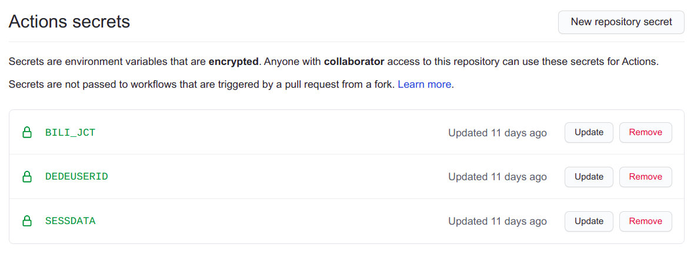
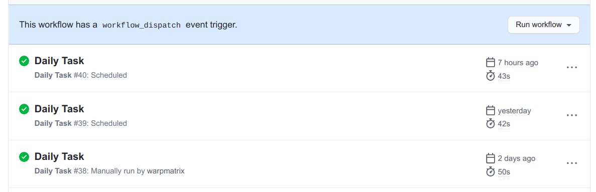

# Run Script by Github Actions

github 每个月提供了一定的 serverless 计算时间供开发者使用，可以完成脚本的执行。

## Quick Start

1. 将该项目的 release 分支拷贝到本地，然后添加到自己的 github 仓库中。（不推荐直接 fork）

    ```plaintext
    git clone -b release https://github.com/warpmatrix/bilibili-script.git
    ```

2. 在 setting 中的 Secrets 加入对应的 `cookie` 信息，实现效果如图：
    

3. 在 actions 中启用 Daily Task 的工作流，随后 github action 根据提供的 cron 信息，在对应的时间段附近执行脚本。当然，第一次运行可以不必等待 cron 时间可以直接手动执行脚本。成功执行的效果见下图：
    

## Advanced Setting

- 自定义配置文件：在 config 文件夹中可以找到配置文件的模板，根据其中的内容修改并创建新的配置文件后，在 [daily.yml](../.github/workflows/daily.yml) 的 `jobs.<job-id>.steps.Run-Task.env` 中添加新的字段 `CFGFILE` 传递配置文件的路径。可以参考 [daily.yml](../.github/workflows/daily.yml) 中 `jobs.user2.steps.Run-Task.env.CFGFILE` 传递的参数。
- cookie 合并：在上面的 cookie 设置中，也可以将三个 cookie 信息：bili_jct、DedeUserID、SESSDATA，以 `key=value` 的形式写在同一个 secret 中。这样需要注意键名大小写敏感，然后修改 [daily.yml](../.github/workflows/daily.yml) 对应的环境变量传输的参数。
- 多账户的支持：要想多账户运行脚本可以在 [daily.yml](../.github/workflows/daily.yml) 中添加新的 job，并且在 `Run Task` 步骤中的 env 变量设置为对应的 cookie 和可选的自定义 yaml 配置文件。可以参考 [daily.yml](../.github/workflows/daily.yml) 中 `jobs.user2` 作为模板，在 `steps.Run-Task.env` 中修改对应传递的参数。
- 脚本的运行时间：在 [daily.yml](../.github/workflows/daily.yml) 的 `on.schedule.cron` 中设置了脚本的运行时间。默认时间为 UTC 的 0:20，即北京时间的 8:20，修改其中的值即可修改脚本运行时间，具体的时间格式为：min hour day mon week。
